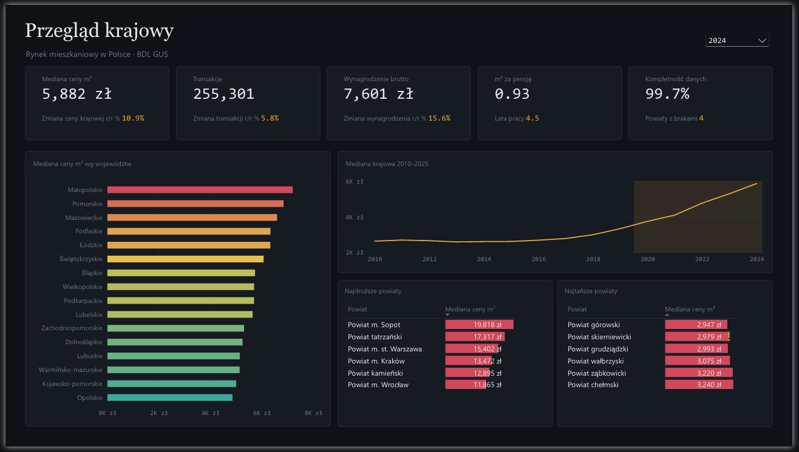
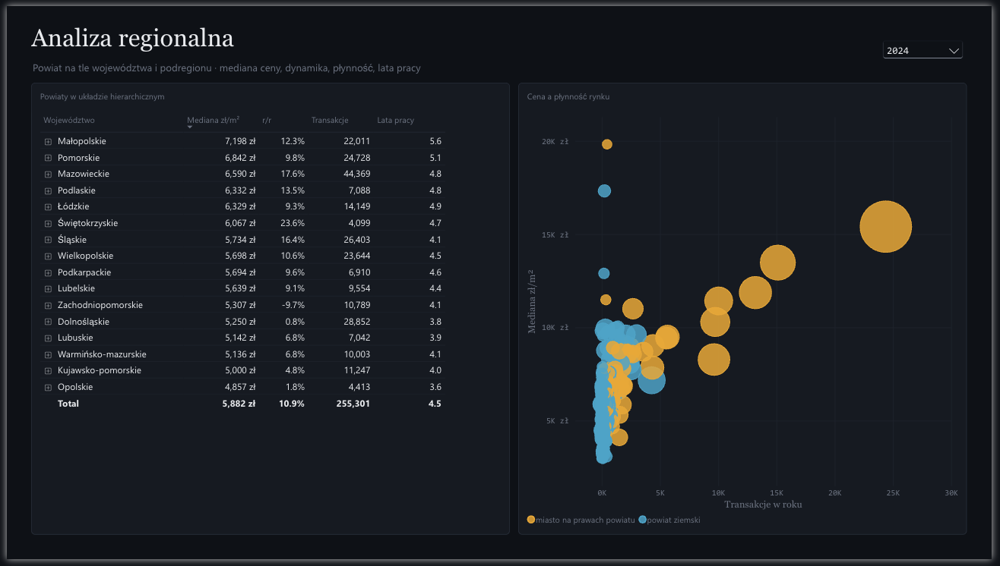
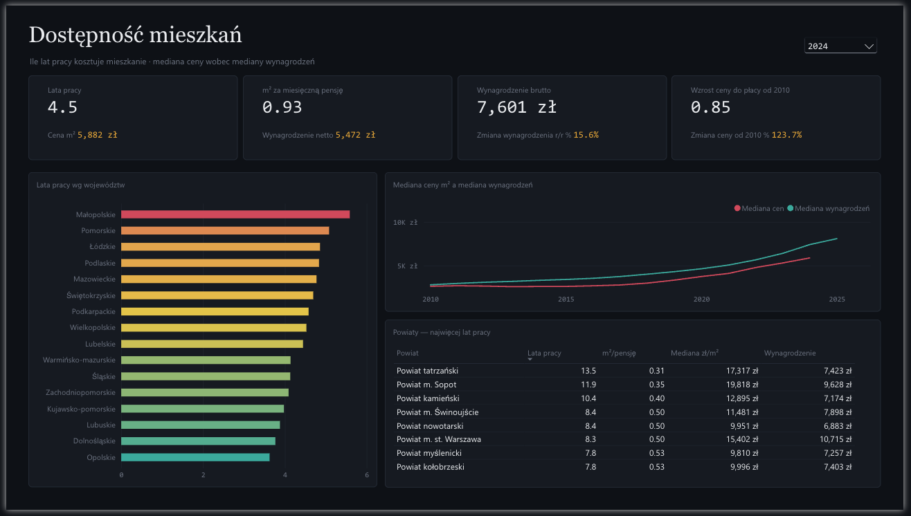
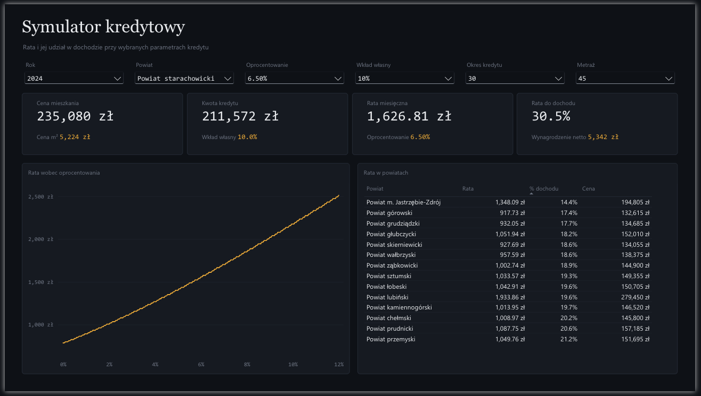
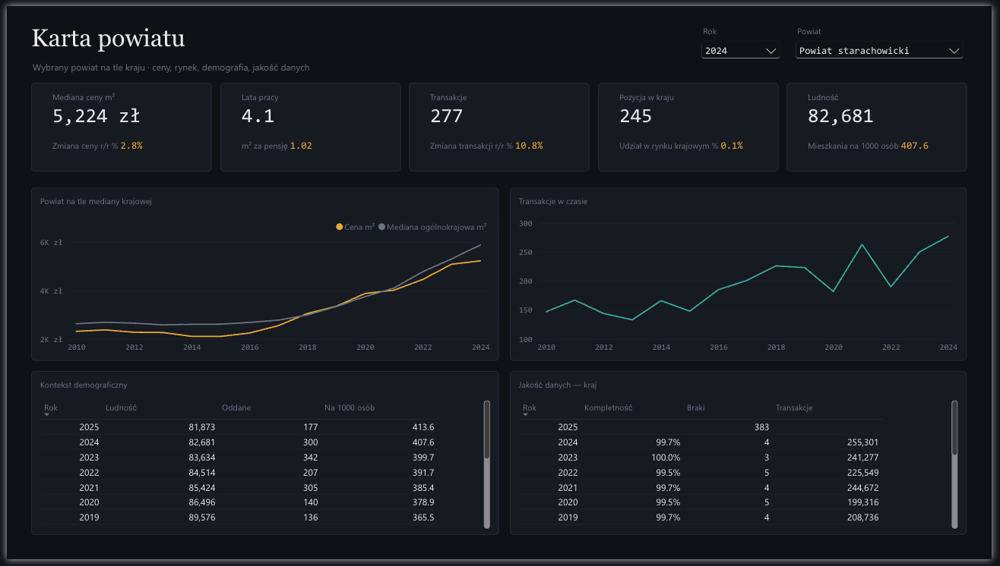

# Lata pracy za metr

Platforma danych licząca dostępność mieszkań w Polsce w latach pracy zamiast w złotówkach: ile lat trzeba pracować za medianę lokalnego wynagrodzenia, żeby kupić mieszkanie po lokalnej medianie ceny.

382 powiaty, lata 2010–2025. Źródło: API Banku Danych Lokalnych GUS.

---

## Architektura

```
BDL API (REST)
     │
     ├─ Azure SQL ref.*          konfiguracja ingestii, słownik flag jakości, log ładowań
     │
Azure Data Factory               Lookup → ForEach → Copy z paginacją po links.next
     ▼
ADLS Gen2  landing/              surowy JSON, ścieżka ingestion_date=/variable_id=
     │
     │  OneLake shortcut
     ▼
Fabric bronze → silver           PySpark: parsowanie, TERYT, flagi jakości, deduplikacja
     ▼
Fabric Warehouse  gold           gwiazda, procedury ładujące, SCD 2 na powiatach
     ▼
Semantic model (Direct Lake)     14 tabel, 49 miar
     ▼
Raport Power BI                  5 stron, definicja w JSON pod kontrolą wersji
```

Ingestia jest sterowana metadanymi. Pipeline czyta z tabeli konfiguracyjnej listę zmiennych do pobrania i iteruje po niej; dodanie nowego wskaźnika BDL to wiersz w bazie, nie zmiana w ADF. Uwierzytelnienie idzie przez managed identity i Key Vault, bez sekretów w definicji pipeline'u.

Bronze przechowuje odpowiedzi API bez zmian. BDL ma limit 500 zapytań na 15 minut, więc poprawka w parserze oznacza ponowne przeliczenie, a nie ponowne pobranie danych.

## Model

Dwie tabele faktów na wspólnych wymiarach. `fact_market` ma ziarno powiat × rok × typ rynku × przedział metrażu i zawiera ceny oraz transakcje. `fact_context` jest grubszy — powiat × rok — i zawiera wynagrodzenia, ludność i mieszkania oddane. Oba wiszą na `dim_territory` i `dim_date`, więc miara dzieli cenę przez wynagrodzenie bez łączenia tabel w zapytaniu.

Hierarchia terytorialna pochodzi z 12-znakowego kodu TERYT, w którym pozycje kodują województwo, podregion i powiat. Pozycje zweryfikowane na endpoincie `/units`.

`dim_territory` jest wymiarem wolnozmiennym typu 2 — zmiana nazwy powiatu zamyka stary wiersz i otwiera nowy, zamiast nadpisywać historię.

Symulator kredytowy stoi na czterech tabelach bez relacji z resztą modelu: `param_rate`, `param_loan_years`, `param_floor_area`, `param_down_payment`. Slicer ustawia wartość, miara odczytuje ją przez `SELECTEDVALUE`, rata przelicza się bez ruszania modelu.

Miary mają bramki na `HASONEVALUE`. Mediana ceny jest zdefiniowana tylko dla jednego powiatu, roku, typu rynku i przedziału metrażu naraz — przy niejednoznacznym kontekście miara zwraca pustkę zamiast liczby z przypadkowego przecięcia filtrów.

## Decyzje

**Mirroring Azure SQL → Fabric poza zakresem.** Wymaga wyłączenia auto-pause na bazie serverless, co przy tej bazie daje około 190 USD miesięcznie przy budżecie 30. Zastąpiony miesięcznym zrzutem tabel `ref.*` do Parquet.

**Direct Lake zamiast trybu Import.** Model czyta pliki Parquet wprost, bez duplikowania danych i bez zapytań na żywo. Koszt: model działa tylko przy aktywnej pojemności Fabrica, a po zmianie struktury tabeli w hurtowni wymaga jawnego odświeżenia — automatyczne aktualizacje obejmują nowe dane, nie przebudowę tabeli.

**Bez mapy choropletowej.** Mapa powiatów w Power BI wymaga własnego GeoJSON i Azure Maps. Macierz województwo → podregion → powiat daje ten sam podział bez zależności zewnętrznej.

**Bez infrastruktury jako kodu.** Środowisko budowane w portalu.

## Raport

Format PBIR — każdy wizual to osobny plik JSON. Zmiany są widoczne w diffie, a powtarzalne elementy generowane skryptem zamiast klikane.

Mediana ceny i dynamika w skali kraju, z rozbiciem na województwa i skrajne powiaty.



Macierz województwo → podregion → powiat oraz cena zestawiona z płynnością rynku. Wielkość bąbla to ludność, kolor odróżnia miasta na prawach powiatu od powiatów ziemskich.



Lata pracy, metry za miesięczną pensję i rozejście się cen z wynagrodzeniami od 2010 roku.



Sześć parametrów kredytu, rata i jej udział w dochodzie. Wykres pokazuje wrażliwość raty na oprocentowanie w całym zakresie 0–12%.



Wybrany powiat na tle mediany krajowej, kontekst demograficzny i kompletność danych.



## Struktura repozytorium

```
sql/                  Azure SQL — warstwa sterująca i dane słownikowe
scripts/              generatory danych referencyjnych z API BDL
fabric/notebooks/     PySpark, bronze → silver
fabric/warehouse/     T-SQL — wymiary, fakty, procedury
fabric/model/         motyw raportu, miary DAX
fabric/workspace/     definicje obiektów Fabrica (integracja Git)
adf/                  Azure Data Factory
```
